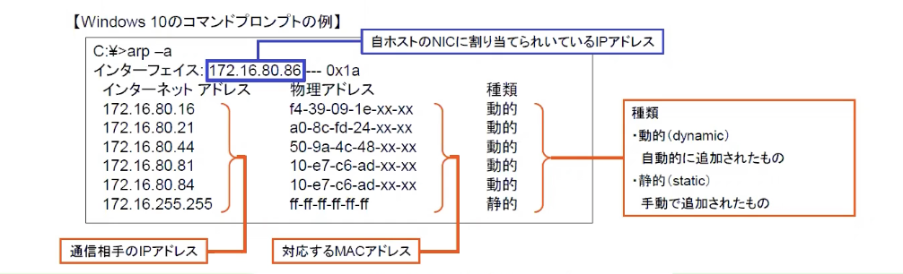

#### OSI基本参照モデル
- ベンダーやOSなどに依存しない、コンピューター通信の標準化の概念
- 役割ごとに7つの層に分離
- それぞれの層が独立している

マルチベンダー環境でもオープンなネットワークを構築できる
階層ごとに機能が独立しているためデバイスなどの開発がしやすい

|層|名前|役割|
|---|:---:|---|
|第7層|アプリケーション層|アプリケーション独自のフォーマットに変換|
|第6層|プレゼンテーション層|ネットワーク共通のフォーマットに変換|
|第5層|セッション層|宛先コンピュータとのセッションの管理|
|第4層|トランスポート層|データの分割・再構築   使用アプリケーションの識別|上位層で使用しているアプリケーションを識別するためにポート番号という識別情報を管理している 上位層で作られたデータを運ぶ上で効率よくデータを運ぶためにデータの分割・再構築を行っている|
|第3層|ネットワーク層|論理アドレスを定義|異なるネットワークへの接続を行う 論理アドレスの具体例: IPアドレス|
|第2層|データリンク層|物理アドレスを定義|同じ物理層で繋がっているデバイス認識してデータを運ぶ   相手を識別するのに使うのが物理アドレス|
|第1層|物理層|データを0と1の信号に変換|物理的な取り決めを行っている|

1~4: 下位層 データを運ぶ
5~7: 上位層 ネットワークを流れるデータを作る
ccnaの学習には下位層の知識が必要

実際にネットワークを用いて通信をしているのはコンピュータ自体ではなく中で動作しているアプリケーション
指定したコンピュータ内の特定のアプリケーションにデータを運ぶ必要がある
それを行うのが第4層

#### 各層の役割とPDU
- カプセル化
  送信側では、各層が扱うデータ（ヘッダ）を付与して下位層へ引き渡す
- 非カプセル化
  受信側では、各層が扱うデータ（ヘッダ）を取り除いて上位層へ引き渡す

左のWebサーバーが右のクライアントにデータを送る際

**サーバ側**
アプリケーション層: アプリケーション独自のフォーマット
プレゼンテーション層: ネットワーク共通のフォーマット
セッション層: これから行う通信の確立・転送・終了のタイミングが決定される
トランスポート層: データが欠落しないようにデータの信頼性が確保される. 効率よくデータを送るためにデータの分割を行う. アプリケーションの識別情報もヘッダとしてふかされる.
ネットワーク層: 最終的なコンピュータを識別するための論理アドレスがヘッダに付加される
データリンク層: 直接繋がっているデバイスの識別のための物理アドレスがヘッダに付加される
物理層: 0と1のビット列が電気信号や機械語に変換さ、ケーブルに送信される

**クライアント側**
物理層: 信号を受信し、0と1のビット列に変換する
データリンク層: ヘッダに含まれる物理アドレスを調べ、自分宛であれば物理アドレスをヘッダより取り除く・自分宛でなければ破棄される
ネットワーク層: ヘッダに含まれる論理アドレスを調べ、自分宛であればネットワーク層のヘッダ情報を取り除く
トランスポート層: 分割されたデータを再構築し、送信元にデータを受信したことを知らせる確認応答をする. データを使用するアプリケーションを確認し、該当するアプリケーションに処理を任せる
上位層: ネットワーク共通のフォーマットからアプリケーション独自のフォーマットに変換し画面に表示する

- PDU(Protocol Data Unit)
  - 各層でしゅりされるデータの総称
  - 付加されたヘッダには、その層のプロトコル処理に必要な情報が入っている
  - データの後ろにも付加される場合がある

#### TCP/IP モデル
- TCP/IP の特徴
  - TCP/IPは4階層
  - 複数のプロトコルの集合体
  - OSI基本参照モデルと対応付けられた階層の役割

#### トランスポート層プロトコル
- TCP(Transmission Control Protocol)
  - コネクション型
  - こう信頼性や通信効率の最適化機能を提供
    - 3wayハンドシェイク、受信確認後や再送処理、フロー制御や輻輳管理
  - ポート番号により上位層のアプリケーションを識別

- UDP(User Datagram Protocol)
  -コネクションレス型
  - TCPに比べて信頼性は低いため、アプリケーション側での再送処理が必要
  - UDPヘッダサイズが小さいことから、高速転送が可能
  - ポート番号により上位層のアプリケーションを識別

#### IPの役割
- IP(Internet Protocol)
  - 送信元と宛先のIPアドレスが含まれる
  - パケットを遠隔地まで正しく転送
  - パケットがネットワークを永遠にループしないように生存時間を定義(TTL=Time To Live)
  - 上位層のプロトコルを示す(プロトコルフィールド)
  - コネクションレス型

  

#### ICMP
- ICMP(Internet Control Message Protocol)
  - IPの機能を補うプロトコル
  - IPに必ず実装
  - IPにカプセル化されて配送

  

#### ARPとARPキャッシ
- ARP(Address Resolution Protocol)
  - 宛先IPアドレスを基に宛先の存在を確認し、宛先のMACアドレスを取得
  - ARPの届く範囲は、同一ブロードキャストドメイン内のみ

  

- ARPキャッシュ
  - IPアドレスとMACアドレスの対応情報をメモリ上に保存
  - キャッシュ情報は有効時間内に更新されない場合は破棄
  - 確認コマンド(Windows系ホスト)
    + arp -a   ARPキャッシュテーブルの表示
    + arp -d   ARPキャッシュの削除(コマンドプロンプトを管理者権限で起動する必要あり)

  

#### アプリケーション層プロトコル

  
