#### ログイン方法
- コンソールポート
  - Cisco IOSの制御信号を送受信するインターフェース
  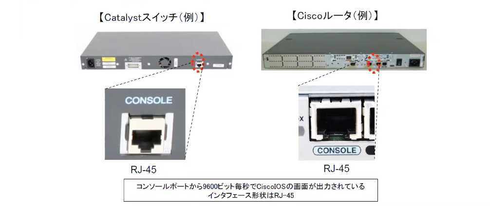

- コンソールケーブルの接続
  - ターミナルソフトを使用して制御する
    + TeraTerm
    + PuTTy
  - コンソールポートとPCのシリアルポート(COMポートまたはUSBポート)を、コンソールケーブル(ロールオーバーケーブル)で接続
    + 最近はPCのUSBポートに接続できるタイプが主流となっている

  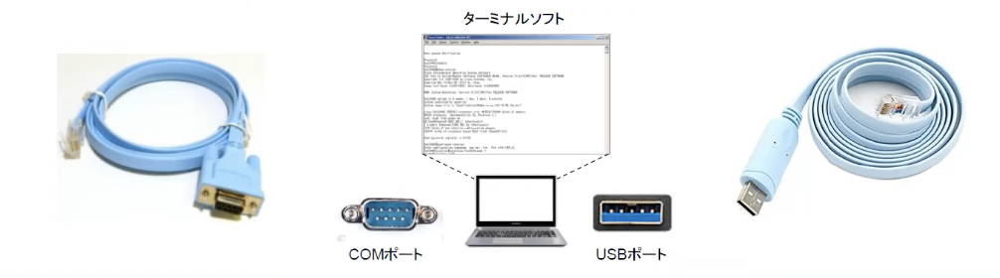

- ターミナルソフトの設定
  - Ciscoデバイスのコンソールポートから送信される制御信号を、正しく受信できるように設定
  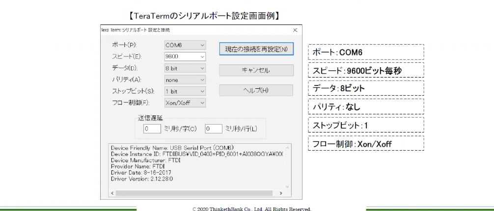

#### 操作モードの変更
- Cisco IOSはCLIベースの操作
- 操作目的に合わせ、適切なモードに変更
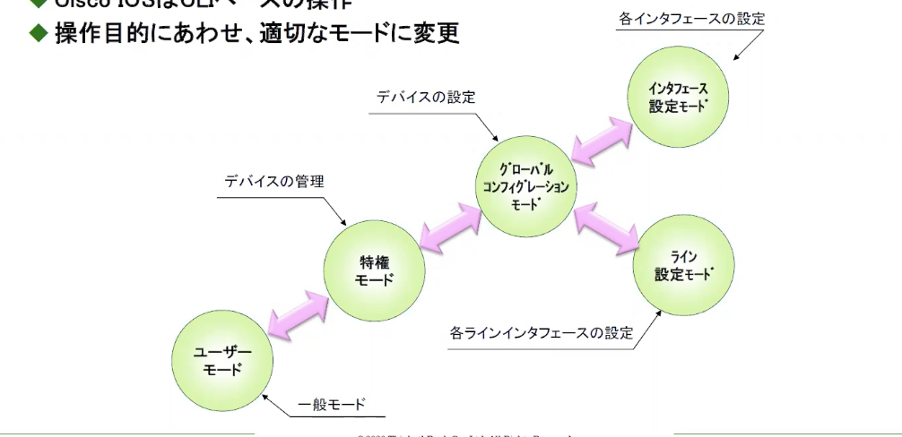

- ユーザーモード
  - ログイン直後のモード
  - 基本情報のみ参照可能
  - 機器設定することはできない
  

- 特権モード
  - 管理者用モード
  - 設定ファイルを参照可能
  - 「enable」コマンドで移動
  

- グローバルコンフィグレーションモード
  - 機器全体に関係する設定モード
  - 「configure terminal」コマンドで移動
  

- インターフェース設定モード
  - インターフェースを設定するモード
  - IPアドレス設定など、インターフェースに関する設定を行うモード
  - 「interface」コマンドで該当するインターフェースを指定
  

- ライン設定モード
  - ラインを設定するモード
  - ログインパスワードの設定など、ラインに関する設定を行うモード
  - 「line」コマンドで該当するラインを指定
  

- 前モードへの移動
  - exitコマンドやdisableコマンドを使用
  
  - 特権モードへの移動
  

#### コマンド補助機能
- ヘルプ機能
  - "?"を入力することで、入力可能なコマンドを表示
  - 何らかのコマンドを入力後に、”?”を入力することで次に有効なコマンドを出力

- 省略入力機能
  - 有効なコマンドを省略して入力可能
    + 他のコマンドと区別できるところまでの入力が必要
    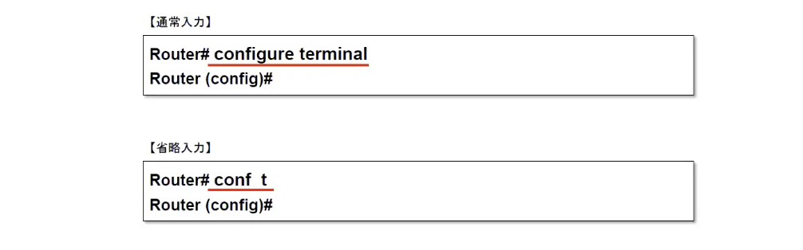

- コマンド補完機能
  - 有効なコマンドとして認識できるところまで入力した状態で、[Tab]キーを押すことにより、コマンドがフルスペルで補完される
  

#### ホスト名の設定
- 管理者が機器を識別できるような名前を設定
  - 「hostname」コマンドで指定
- ホスト名はログインプロンプトに表示される
  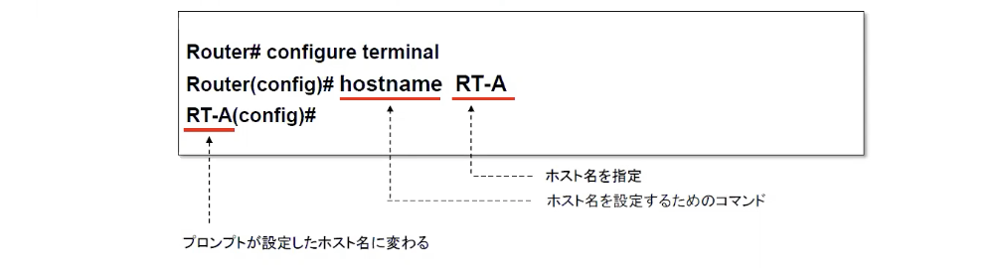

#### インターフェースの指定
- インターフェース設定モードに移動するには、インターフェースタイプとインターフェースナンバーを指定
  - インターフェースナンバーは機種によって異なる
  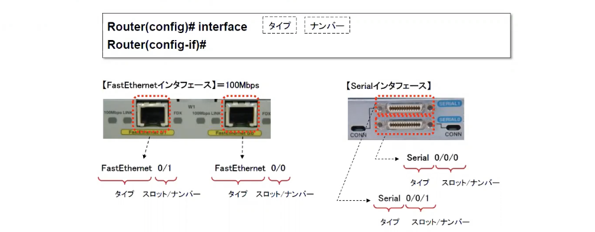
  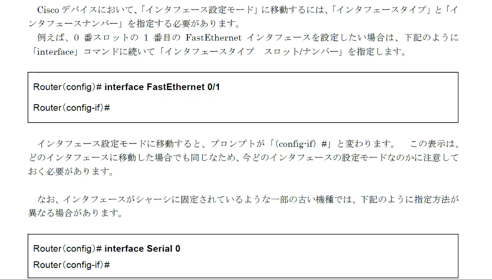

- Catalystスイッチでは、スロットが存在しないボックス型のタイプでも、スロットナンバーを指定する
- Catalystスイッチのインターフェースタイプ例
  

#### パスワードの設定
- コンソールパスワード
  - コンソールポート経由で接続する際に、セット可能なパスワード
  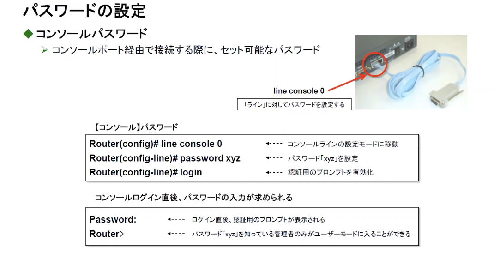

- enable password
  - ユーザーモードから特権モードに移行する際にセット可能なパスワード
  - showコマンドでの出力で暗号化されない
  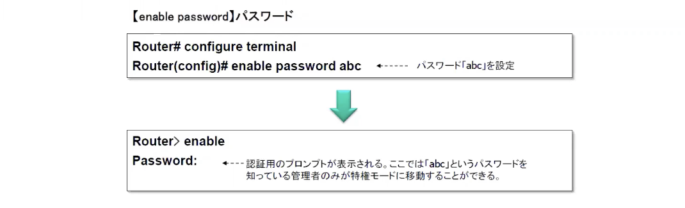

- enable secret
  - ユーザーモードから特権モードに移行する際にセット可能なパスワード
  - showコマンドでの出力で暗号化される
  

- vtyパスワード
  - TELNETやSSHログインする際にセット可能なパスワード
  - ネットワーク経由でリモート管理する場合に必要
  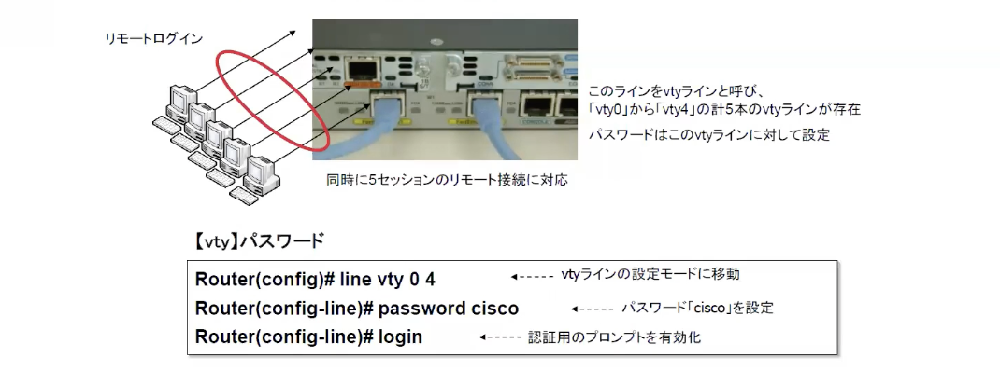

#### 設定情報の確認
- CiscoルータやCatalystスイッチへの設定変更は、RAM内の設定ファイル(runnning-config)に反映される
- running-configは電源をきると消去される
- 「sho running-config」コマンドで確認できる

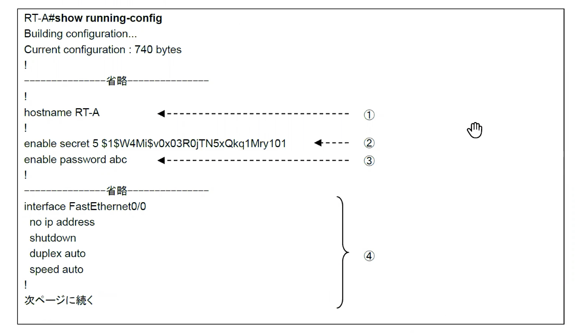
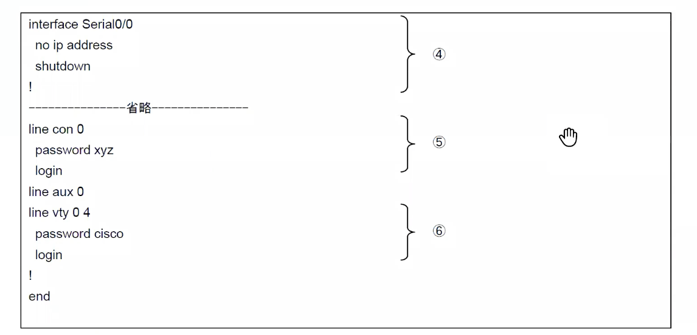

#### 設定情報のセーブとロード
- 設定情報のセーブ
  - 設定情報を残しておくには、NVRAM内に「startup-config」ファイルとして保存する必要がある
  - 「copy」コマンドにより保存
  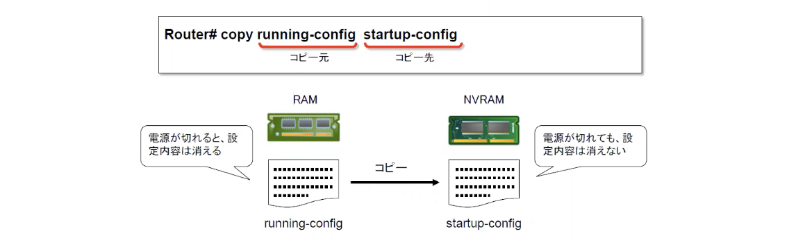

- 設定情報のロード
  - 何らかの原因でトラブルが発生した場合、すぐに設定変更前の状態に戻す
  - NVRAM内のstartup-configファイルを、RAM内のrunning-configファイルへ展開
  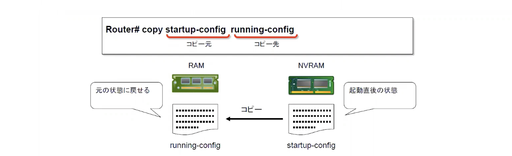